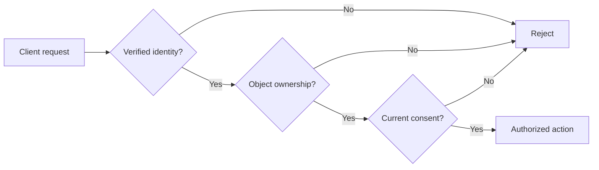

# DotSpeak — Object-level authorization and consent (case study)

**Status:** private source reviewed; public synthetic demonstration available; **no live-system assessment**.

## Context / scope
DotSpeak is an education-related application with responsible-adult and child account concepts. The review considered *server-side authorization patterns* without exposing private application code or personal records.

## Threat hypothesis
A user who is authenticated as one guardian should not be able to read or modify another guardian's child record by changing a child identifier (an object-level authorization problem / BOLA). Consent cannot be inferred solely from a client-side flag, and usage caps must not fail open after a storage failure.

## Observed in the owner's private source (2026-10-08)
- An authentication helper requires a verified guardian context.
- A child-access helper checks active guardian-to-child relationships and denies mismatches.
- A consent helper requires an affirmative, current consent version.
- A quota helper denies unavailable usage accounting or exhausted quota.
- Source tests define negative cases for cross-account access, stale consent and persistence failures.

**Evidence level: source-file inspection, not execution or production verification.**

## Trust boundary (conceptual)

## Independent lab
Review the synthetic authorization/consent examples in [../examples/security_controls.py](../examples/security_controls.py) and [their tests](../examples/tests/test_security_controls.py). They are **not** the DotSpeak implementation.

Try explaining:
1. Why authentication alone does not prevent cross-account data access.
2. Why object ownership should be checked on each relevant server-side request.
3. How a revoked or outdated consent state must affect authorization.
4. Why multiple devices, cache invalidation and persistence failures complicate this model.

## Interview-relevant mapping
- OWASP API Security Top 10 2023: API1 Broken Object Level Authorization (conceptual).
- Security principles: deny by default, least privilege, explicit consent.
- Relevant skills: authorization, access control testing, multi-tenant threat modeling.

## Unverified / risk questions
Is the ownership check applied consistently to every route? Is it atomic with data access? Are consent withdrawal and concurrent requests handled? Is a tenant identifier trusted from a header? No claim is made without endpoint and database-level tests.

## Acceptance criteria for a later completed case
- [ ] Run independent synthetic tests and explain results in English.
- [ ] Personally construct at least two negative cross-account cases.
- [ ] Prepare dated redacted logs/screenshots or transcripts.
- [ ] Review authorized project routes for server-side authorization coverage.
- [ ] Record residual risks, including consent revocation.
