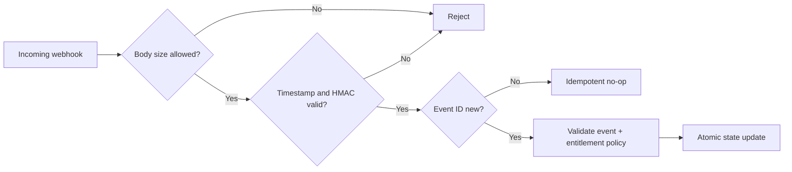

# InstantStudy — Signed billing webhook trust boundary (case study)

**Status:** private source reviewed; independent synthetic tests added; **not a production payment audit**.

## Security problem
A payment provider webhook is untrusted internet input. It must not grant paid access merely because a request says `payment_completed`.

## Observed in the owner's private source (2026-10-08)
- Code verifies an HMAC-SHA256 signature over a timestamp and the original body.
- A freshness tolerance rejects events whose timestamps are too old (or beyond tolerance).
- A constant-time digest comparison is used after a length check.
- Request body size is capped in source.
- Billing tests exercise a fresh valid signature, a stale signature and allowlisted plan identifiers.

**Evidence level: inspected code/tests; the private test suite was not executed for this case study.**

## Conceptual flow

The **event ID and idempotency steps in this diagram are desired defense-in-depth**, not verified capabilities of the private code reviewed.

## Independent educational example
The synthetic [security_controls.py](../examples/security_controls.py) implements an educational verifier; [tests](../examples/tests/test_security_controls.py) demonstrate good, tampered, malformed and stale inputs. Fake webhook bodies and fake secrets only.

## Security trade-offs
- A valid HMAC confirms authenticity of the signed bytes, not business correctness.
- Timestamp freshness **does not prevent replay during the valid time window**. Durable event-ID deduplication must be added and tested at the state update boundary.
- Entitlement should be server-authoritative, transaction-aware and updated idempotently.
- Provider reconciliation and webhook redelivery handling need project-specific checks.

## Interview-relevant mapping
OWASP API authentication / authorization boundaries; integrity via MAC; cryptographic comparisons; secure business logic and replay protection.

## Acceptance criteria for a completed case
- [ ] Personally execute mock signature tests.
- [ ] Explain why parsing/re-serializing the JSON may invalidate a signature.
- [ ] Demonstrate a repeat-event test with a durable deduplication store, when implemented.
- [ ] Validate ordering and idempotency on a **test** environment with authorization.
- [ ] Record sanitized evidence, scope and residual risk.
